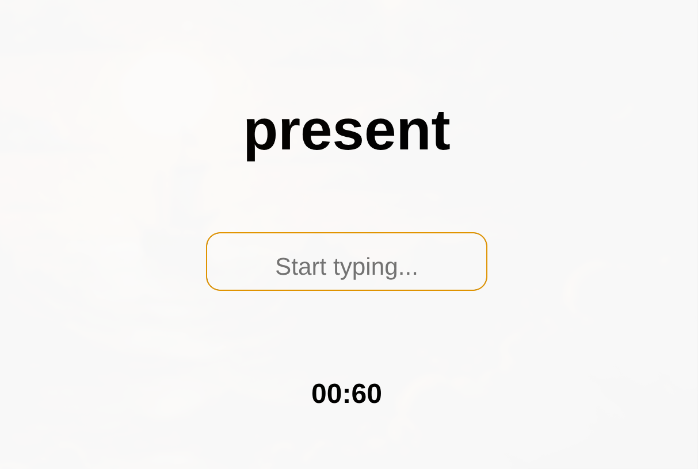
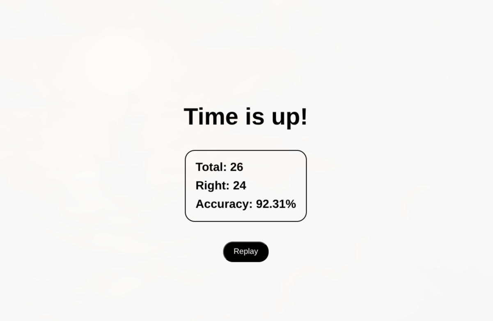

# Simple Typing Game

A minimalist browser-based typing game. Type the displayed word correctly before the timer runs out.

## How to play

1. Open `index.html` in your browser
2. Start typing the word shown on screen — the timer begins on your first keystroke
3. Match the word exactly to score a point; mismatches count as wrong
4. When the 60-second timer ends, your stats are shown
5. Hit **Replay** to go again

## Stats

At the end of each round you'll see:

- **Total** — words attempted
- **Right** — words typed correctly
- **Accuracy** — percentage of correct words

## Project structure

```
index.html   — game UI
script.js    — game logic
words.js     — word list
style.css    — styles
```

## Screenshots

| Game                                 | Results                               |
| ------------------------------------ | ------------------------------------- |
|  |  |
